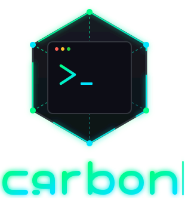

<div align="center">
    <h1></h1>

### Your First Terminal.

*A safe terminal playground that helps beginners build confidence through guided experimentation and documentation-first learning.*

**Built to Be Outgrown.**

<br>


</div>

---

## What is Carbon?

Learning the Linux terminal can be intimidating.

For many beginners, the command line feels fragile—one wrong command and something might break. Existing tutorials often assume prior knowledge, while interactive sandboxes frequently prioritize quizzes over real experimentation.

Carbon was created to bridge that gap.

Instead of asking learners to memorize commands, Carbon provides a safe, isolated Unix-like environment where they can freely experiment, make mistakes, and learn through doing.

Rather than replacing the terminal, Carbon exists to build the confidence needed to eventually leave it behind.

> **Carbon is successful when users no longer need it.**

---

# Philosophy

Carbon is built around five principles.

## Learn by Doing

Every lesson asks learners to interact with a real terminal instead of answering multiple-choice questions.

Learning happens through experimentation.

---

## Documentation First

Documentation should never be an afterthought.

Every command is accompanied by beginner-friendly documentation that explains not only *how* to use it, but *why* it exists.

---

## Safe Exploration

Mistakes are encouraged.

Every learner works inside an isolated virtual filesystem where experimentation carries no risk.

Delete files.

Create directories.

Try incorrect commands.

Nothing can damage the host system.

---

## Progressive Independence

Carbon intentionally avoids becoming a permanent learning environment.

As confidence grows, learners should naturally transition to using a real Linux terminal.

Carbon isn't the destination.

It's the first step.

---

## Simplicity

Carbon avoids unnecessary complexity.

The goal isn't to simulate every feature of a Unix shell.

The goal is to teach the fundamentals clearly and confidently.

---

# Features

## Interactive Lessons

Learn through guided objectives instead of passive reading.

- Step-by-step lessons
- Progressive difficulty
- Immediate validation
- Context-aware hints
- Goal-oriented learning

---

## Virtual Filesystem

Each learner receives an isolated Unix-like filesystem.

Supported operations include:

- `pwd`
- `ls`
- `cd`
- `mkdir`
- `touch`
- `cat`
- `rm`
- `rmdir`

Commands behave consistently without affecting the user's computer.

---

## Documentation Library

Every command includes beginner-friendly documentation.

Documentation focuses on:

- purpose
- syntax
- examples
- common mistakes
- related commands

---

## Lesson Validation

Carbon validates **results**, not memorization.

Examples include:

- executing the correct command
- reaching the correct directory
- creating a file
- creating a directory
- verifying file contents

Lessons respond to the learner's actual terminal state.

---

## Mux

Mux is Carbon's mascot.

Mux isn't an AI assistant.

Instead, Mux exists to:

- explain unfamiliar terminology
- encourage experimentation
- provide progressively stronger hints
- celebrate genuine progress

The goal is to guide learners without removing the satisfaction of discovery.

---

# Why Carbon?

Most beginner resources fall into one of two categories.

| Traditional Tutorials | Carbon |
|-----------------------|---------|
| Read → Memorize | Read → Experiment |
| Passive learning | Active learning |
| Static examples | Interactive lessons |
| Real system risk | Safe virtual filesystem |
| Limited feedback | Immediate validation |
| Quiz-based | Task-based |

Carbon focuses on helping learners develop confidence—not simply complete lessons.

---

# Built to Be Outgrown

Many educational platforms are designed to keep users engaged indefinitely.

Carbon isn't.

The objective is simple:

> Help learners become confident enough that they no longer need Carbon.

When a learner opens a real Linux terminal without hesitation, Carbon has done its job.

# Architecture

Carbon follows a layered architecture that separates presentation, business logic, persistence, and learning content.

```
                       Frontend (React)
                              │
                       REST API (Axum)
                              │
                ┌─────────────┴─────────────┐
                │                           │
        Authentication              Terminal Session
                │                           │
                └─────────────┬─────────────┘
                              │
                    Command Dispatcher
                              │
          ┌───────────────────┼───────────────────┐
          │                   │                   │
          ▼                   ▼                   ▼
Filesystem Service     Lesson Runtime      Documentation
          │                   │
          ▼                   ▼
Filesystem Repository   Lesson Repository
          │                   │
          └─────────────┬─────┘
                        ▼
                     SQLite
```

The backend is responsible for **all application logic**.

The frontend is responsible for **presentation only**.

This separation keeps learning content, validation, and filesystem behaviour consistent across every client.

---

# How Carbon Works

Every terminal command follows the same execution pipeline.

```
User types command

        │

        ▼

Command Parser

        │

        ▼

Command Dispatcher

        │

        ▼

Filesystem Service

        │

        ▼

Command Result

        │

        ▼

Lesson Runtime

        │

        ▼

Lesson Validation

        │

        ▼

Progress Update

        │

        ▼

Frontend
```

Instead of checking whether a learner *knows* a command, Carbon verifies what actually happened inside the virtual terminal.

---

# Project Structure

```
.
├── apps
│   ├── server                 # Rust backend
│   └── web                    # React frontend
│
├── content
│   ├── lessons                # YAML lesson definitions
│   ├── docs                   # Command documentation
│   ├── glossary               # Beginner terminology
│   ├── mascot                 # Mux dialogue
│   └── assets                 # Images and media
│
├── docs
│   ├── architecture           # System architecture
│   ├── adr                    # Architecture decisions
│   ├── research               # User research
│   └── testing                # Test plans
│
└── README.md
```

The repository intentionally separates **application code** from **educational content**.

This allows lessons and documentation to evolve independently of the backend.

---

# Technology Stack

## Backend

- Rust
- Axum
- SQLx
- SQLite
- Tokio
- Serde
- Argon2
- JWT

---

## Frontend

- React
- TypeScript
- Vite
- Tailwind CSS

---

## Content

- Markdown
- YAML

Lessons, documentation, glossary entries, and mascot dialogue are all stored as plain text, making them easy to review, version, and contribute to.

---

# Core Components

## Authentication

Handles:

- registration
- login
- password hashing
- JWT generation
- user initialization

Each newly registered user receives:

- a virtual filesystem
- an initial lesson
- a clean learning environment

---

## Virtual Filesystem

Every learner receives an isolated filesystem stored inside SQLite.

Supported operations include:

- `pwd`
- `ls`
- `cd`
- `mkdir`
- `touch`
- `cat`
- `rm`
- `rmdir`

Because the filesystem is virtual, learners can experiment without affecting their own computer.

---

## Lesson Engine

Lessons are written as YAML files and loaded during application startup.

Each lesson defines:

- metadata
- objectives
- hints
- validation rules
- rewards

Validation is completely data-driven, making new lessons easy to create without changing backend logic.

---

## Documentation

Every command has accompanying documentation written in Markdown.

Unlike traditional references, Carbon's documentation is written specifically for beginners.

Documentation emphasizes:

- purpose
- intuition
- examples
- common mistakes
- related commands

---

## Mux

Mux is Carbon's learning companion.

Rather than solving problems outright, Mux helps learners build confidence by:

- introducing unfamiliar concepts
- offering progressively stronger hints
- encouraging experimentation
- celebrating successful discoveries

Mux complements the lesson system instead of replacing it.

---

# Design Principles

Carbon follows several architectural principles.

### Separation of Concerns

Each subsystem owns a single responsibility.

- Terminal executes commands.
- Filesystem manages storage.
- Lesson Runtime validates learning.
- Frontend renders the experience.

---

### Content-Driven Learning

Lessons are data.

Documentation is data.

Dialogue is data.

This allows educators and contributors to improve the learning experience without modifying backend code.

---

### Backend as the Source of Truth

Validation, progression, filesystem state, and authentication all live on the backend.

The frontend never attempts to reproduce business logic.

---

### Built for Extension

New lessons.

New commands.

New documentation.

New learning paths.

Carbon is designed so that these additions require minimal changes to the underlying architecture.

# Getting Started

## Prerequisites

Before running Carbon locally, ensure you have the following installed.

### Backend

- Rust (latest stable)
- Cargo

### Frontend

- Node.js 20+
- npm (or pnpm)

### Database

Carbon uses SQLite by default.

No additional database server is required.

---

# Installation

Clone the repository.

```bash
git clone https://github.com/<your-username>/carbon.git
cd carbon
```

---

## Backend

Navigate to the backend.

```bash
cd apps/server
```

Install dependencies.

```bash
cargo build
```

Copy the example environment configuration.

```bash
cp .env.example .env
```

Configure the environment if necessary.

```env
HOST=0.0.0.0
PORT=3000

DATABASE_URL=sqlite://apps/server/data/genesis.db

JWT_SECRET=your-secret

RUST_LOG=info
```

Run database migrations.

```bash
sqlx migrate run
```

Start the backend.

```bash
cargo run
```

The server will be available at

```
http://localhost:3000
```

---

## Frontend

Navigate to the frontend.

```bash
cd apps/web
```

Install dependencies.

```bash
npm install
```

Start the development server.

```bash
npm run dev
```

The frontend will be available at

```
http://localhost:5173
```

---

# Development

Carbon is divided into two independent applications.

| Application | Responsibility |
|-------------|----------------|
| `apps/server` | Backend API, terminal, lessons, filesystem |
| `apps/web` | User interface |

Both can be developed independently.

---

# Backend Overview

The backend is responsible for:

- authentication
- lesson progression
- command execution
- virtual filesystem
- validation
- persistence

Business logic always resides on the server.

---

# Frontend Overview

The frontend is responsible for:

- rendering lessons
- displaying documentation
- terminal interface
- progress visualization
- user interaction

The frontend intentionally contains minimal business logic.

---

# Learning Content

Carbon separates educational content from application code.

```
content/

├── lessons/
├── docs/
├── glossary/
└── mascot/
```

This allows contributors to improve lessons without modifying the backend.

---

## Lessons

Lessons are written in YAML.

Each lesson contains:

- metadata
- objectives
- hints
- validation rules
- progression

Lessons are loaded during server startup.

---

## Documentation

Command documentation is written in Markdown.

Every documented command should include:

- purpose
- syntax
- examples
- common mistakes
- related commands

Documentation is designed for beginners rather than experienced Linux users.

---

## Glossary

The glossary explains unfamiliar terminology encountered throughout lessons.

Examples include:

- shell
- terminal
- PATH
- directory
- process

Definitions should be concise and beginner-friendly.

---

## Mux

Mux dialogue is stored separately from lessons.

This allows the learning experience to evolve without changing lesson logic.

---

# API

The backend exposes a REST API consumed by the frontend.

Major endpoints include:

```
POST   /auth/register
POST   /auth/login

GET    /lessons
GET    /lessons/{id}

POST   /terminal

GET    /docs/{command}
```

Additional endpoints may be introduced as Carbon grows.

---

# Testing

Backend

```bash
cargo test
```

Linting

```bash
cargo clippy
```

Formatting

```bash
cargo fmt
```

Frontend

```bash
npm run lint
```

Before opening a pull request, ensure:

- formatting passes
- lints pass
- tests pass
- documentation is updated when necessary

---

# Documentation

Project documentation is located under:

```
docs/
```

Including:

```
architecture/
adr/
research/
testing/
```

Detailed command documentation and learning content are stored separately under:

```
content/
```

---

# Contributing

Contributions are welcome.

Please read:

```
CONTRIBUTING.md
```

before opening a pull request.

The contributing guide explains:

- project philosophy
- coding standards
- lesson guidelines
- documentation standards
- commit conventions
- pull request checklist

---

# Project Status

Carbon is currently under active development.

Planned work includes:

- additional Linux commands
- expanded lesson paths
- richer documentation
- accessibility improvements
- improved terminal experience
- more interactive learning features

Follow the roadmap in the repository for upcoming milestones.
